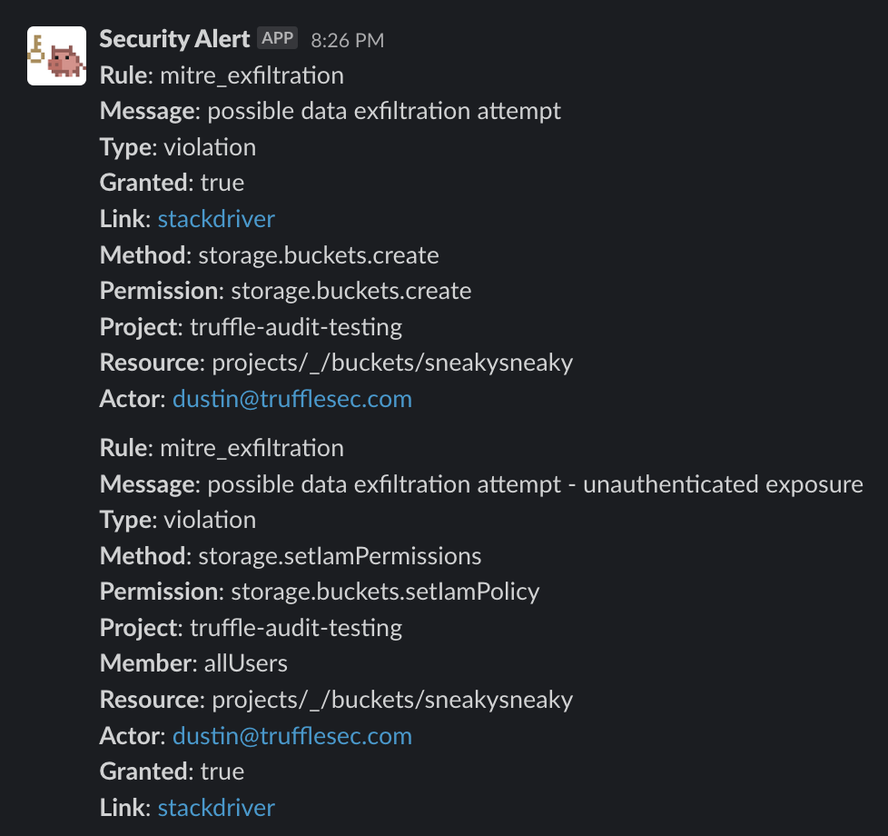

# logwarden

Process all of your GCP audit logs against OPA Rego policies and alert for violations in real-time.

Some amount of policy coverage for MITRE ATT&CK Tactics are included as well as a handful of other helpful rules.
The included policies may be noisy for your organization and adjustment of them for your environment is encouraged.



## Usage

```bash
$ logwarden --help
usage: logwarden --project=PROJECT --subscription=SUBSCRIPTION [<flags>]

GCP Auditor is a tool to audit GCP logs against a set of rego policies.

Flags:
  --help                       Show context-sensitive help (also try --help-long and --help-man).
  --policies="policy"          Path to policies folder.
  --project=PROJECT            GCP Project ID.
  --subscription=SUBSCRIPTION  Pub/Sub subscription to audit.
  --secret-name="logwarden"  GCP Secret name to use for GCP Auditor.
  --json                       Output results as JSON.
  --slack-webhook              Enable Slack webhook.
  --webhook                    Enable JSON HTTP POST webhook output.
```

### GCP Secret format

```
SLACK_WEBHOOK=https://hooks.slack.com/services/TELXXXXXX/XXXXXXXXX/XXXXXXXXXXXXXXXXX

WEBHOOK_URL=https://your.server/post
```

## Installation

Logwarden requires your audit logs to be published to GCP pub/sub via a logging sink.
We've provided terraform code to deploy Logwarden via Cloud Run, create organization logging sink, a pub/sub topic+subscription, and configure IAM for them to work together.

### Terraform 

Most of the infrastructure configuration is encapsulated within a Terraform module. Dynamic configuration values, such as webhooks or API keys can be passed in via a seprarate Google Secret resource defined in the root module.

An example configuration is available in the `terraform` sub-directory of this repository. The module expects that the OPA policies will be provided in a sub-directory of the repository with the `.rego` extension. The specific directory is passed in as the input variable `policy_source_dir`. Default policies for Google Cloud are available in the `policy/gcp` sub-directory.

Specific deployments can be configured via `terraform.tfvars` files. Input variables are defined as follows:

- `environment`: Environment for a specific deployment, such as "prod" or "dev".
- `project_id`: ID of a Google Cloud project.
- `ingress`: Ingress configuration for the Google Cloud Run service.
- `region`: Google Cloud region for a specific deployment.
- `organization_id`: Google Cloud organization ID.
- `logging_sink_filter`: Defines what log types are collected by the log sink. A default value has been provided.
- `docker_image`: The docker image that contains the logwarden binary.
- `container_args`: Runtime arguments for logwarden(passed in a container arguments). 
- `policy_source_dir`: Subdirectory containing OPA policies as rego files.

The configuration can be copied from the `terraform` directory, with the relevant values populated in `terraform.tfvars`. Users will need to configure a separate Google Secret resource.

## MITRE ATT&CK Tactics

[Source](https://attack.mitre.orghttps://attack.mitre.org/tactics/enterprise/)

|ID|Name|Description|
|:----|:----|:----|
|[TA0043](https://attack.mitre.org/tactics/TA0043)|[Reconnaissance](https://attack.mitre.org/tactics/TA0043)|The adversary is trying to gather information they can use to plan future operations.|
|[TA0042](https://attack.mitre.org/tactics/TA0042)|[Resource Development](https://attack.mitre.org/tactics/TA0042)|The adversary is trying to establish resources they can use to support operations.|
|[TA0001](https://attack.mitre.org/tactics/TA0001)|[Initial Access](https://attack.mitre.org/tactics/TA0001)|The adversary is trying to get into your network.|
|[TA0002](https://attack.mitre.org/tactics/TA0002)|[Execution](https://attack.mitre.org/tactics/TA0002)|The adversary is trying to run malicious code.|
|[TA0003](https://attack.mitre.org/tactics/TA0003)|[Persistence](https://attack.mitre.org/tactics/TA0003)|The adversary is trying to maintain their foothold.|
|[TA0004](https://attack.mitre.org/tactics/TA0004)|[Privilege Escalation](https://attack.mitre.org/tactics/TA0004)|The adversary is trying to gain higher-level permissions.|
|[TA0005](https://attack.mitre.org/tactics/TA0005)|[Defense Evasion](https://attack.mitre.org/tactics/TA0005)|The adversary is trying to avoid being detected.|
|[TA0006](https://attack.mitre.org/tactics/TA0006)|[Credential Access](https://attack.mitre.org/tactics/TA0006)|The adversary is trying to steal account names and passwords.|
|[TA0007](https://attack.mitre.org/tactics/TA0007)|[Discovery](https://attack.mitre.org/tactics/TA0007)|The adversary is trying to figure out your environment.|
|[TA0008](https://attack.mitre.org/tactics/TA0008)|[Lateral Movement](https://attack.mitre.org/tactics/TA0008)|The adversary is trying to move through your environment.|
|[TA0009](https://attack.mitre.org/tactics/TA0009)|[Collection](https://attack.mitre.org/tactics/TA0009)|The adversary is trying to gather data of interest to their goal.|
|[TA0011](https://attack.mitre.org/tactics/TA0011)|[Command and Control](https://attack.mitre.org/tactics/TA0011)|The adversary is trying to communicate with compromised systems to control them.|
|[TA0010](https://attack.mitre.org/tactics/TA0010)|[Exfiltration](https://attack.mitre.org/tactics/TA0010)|The adversary is trying to steal data.|
|[TA0040](https://attack.mitre.org/tactics/TA0040)|[Impact](https://attack.mitre.org/tactics/TA0040)|The adversary is trying to manipulate, interrupt, or destroy your systems and data.|

## Rego reference

- [Rego Policy Reference](https://www.openpolicyagent.org/docs/latest/policy-reference/)
- Policy blocks are ORed, but evaluations within a policy are ANDed
- Use the policy block signature provided in the example policies for compatability, and see the [template](policy/gcp/template.rego) for a starting point

## Todo (help wanted!)

Implement findings from
- https://github.com/garrettwong/gcp-mitre-attack-external
- https://github.com/RhinoSecurityLabs/GCP-IAM-Privilege-Escalation
- implement additional GCP permission and method coverage
